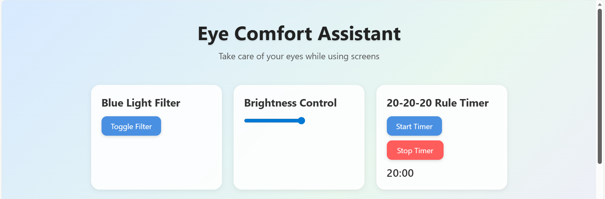
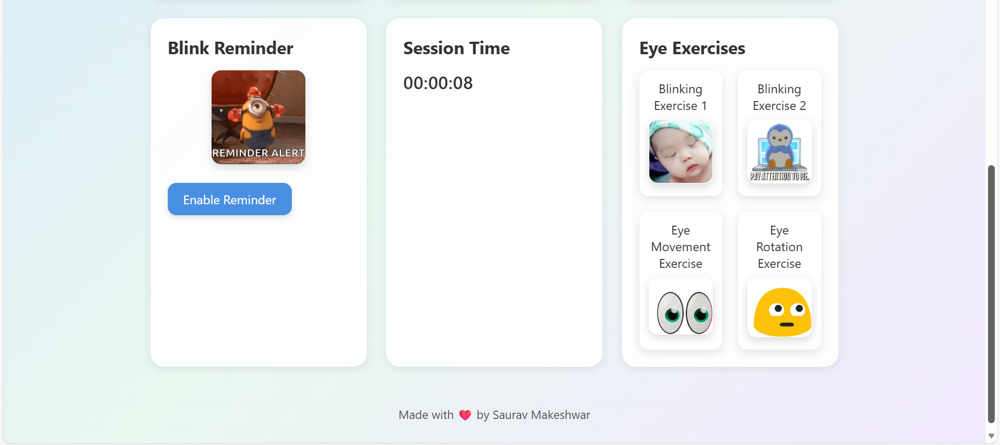

# 👁️ Eye Comfort Assistant  
A modern web-based wellness tool designed to reduce digital eye strain during long computer usage sessions.  
Built using **HTML, CSS, and JavaScript** — no frameworks.

---

## 🌟 Overview  
Eye Comfort Assistant is an interactive and visually calming web application that helps users relax their eyes while working on screens.  
It includes features like blue light filter, brightness adjustment, blink reminders, 20-20-20 rule timer, session time tracking, and simple eye exercises.

This tool promotes healthy screen habits in a lightweight, beautiful UI.

---

## ✨ Features  

### 🔵 Blue Light Filter  
Reduces harsh blue light by applying a warm overlay to the screen.

### 🔅 Brightness Control  
Allows users to dim the screen beyond system limitations.

### ⏳ 20-20-20 Rule Timer  
Helps follow the eye-care rule:  
Every **20 minutes**, look **20 feet away** for **20 seconds**.

### 👁️ Blink Reminder  
Reminds users to blink periodically to avoid dry eyes.  
Toggle between **Enable** and **Disable** easily.

### 🕒 Session Timer  
Tracks how long the user has been working in real time.

### 🧘 Eye Exercises  
Includes 4 GIF-based exercises to relax eye muscles:  
- Blinking Exercise 1  
- Blinking Exercise 2  
- Eye Movement Exercise  
- Eye Rotation Exercise  

### 🎨 Modern UI  
Soft gradients, card components, shadows, animations, and perfect spacing for a calming look.

---

## 📸 Screenshots  

### 🖥️ Main Dashboard  


### 👀 Exercise Section  


---

## 🛠️ Technologies Used  
- HTML  
- CSS  
- JavaScript  

---

## 🚀 How to Run Locally  

1. Clone the repository: ```bash
git clone https://github.com/ssv23-5085/Eye-Comfort-Assistant.git

2. Open the folder
3. Run the app by opening: index.html

🔮 Future Enhancements

- Pop-out mini window for floating reminders

- Dark/Light theme toggle

- Sound-based reminders

- Custom timer intervals

- Add more eye exercises

- Mobile app version

  ❤️ Developed By
     Saurav Makeshwar
     Made with care to promote healthy screen habits.

```bash
git clone https://github.com/<your-username>/Eye-Comfort-Assistant.git
